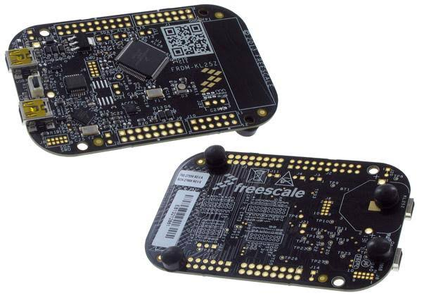
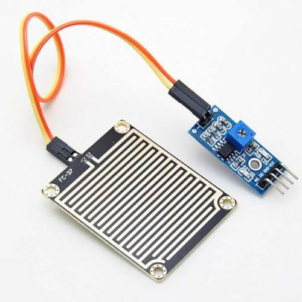
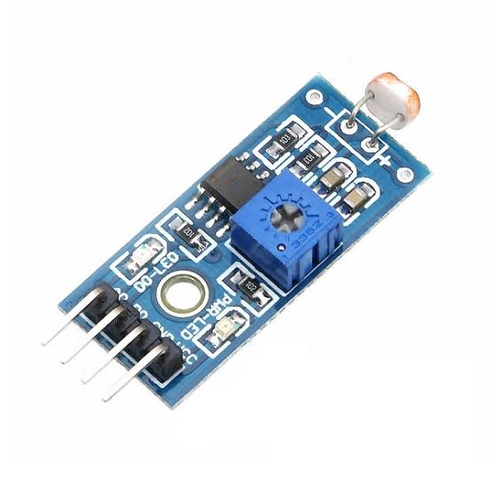
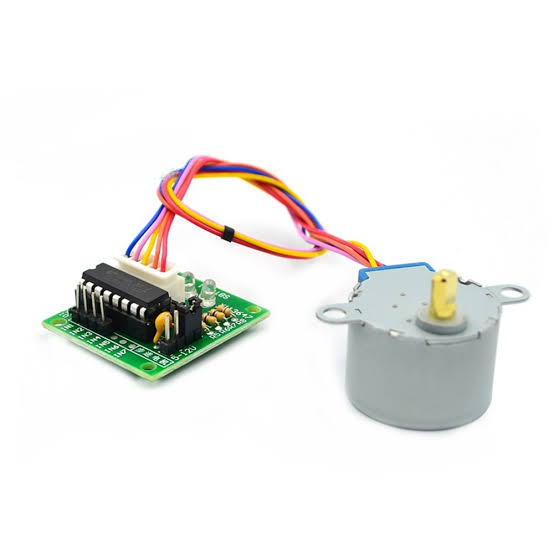
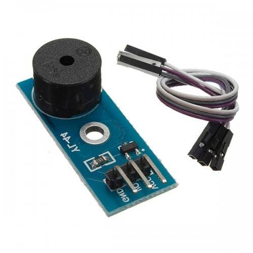

# Cortina-Automatizada

Repositório dedicado ao projeto final para a disciplina de Microcontroladores, na UFC - campus Quixadá.

## Descrição do sistema

Este projeto visa automatizar o controle de cortinas/persianas de forma acessível, utilizando um microcontrolador para gerenciar as operações e interagir com os sensores. O sistema apresenta as seguintes funcionalidades:

- Controle de Luminosidade: O microcontrolador realiza leituras periódicas de um sensor de luminosidade para determinar se é dia ou noite. Se for identificado que é dia, a cortina é aberta usando um motor de passos. Caso contrário, a cortina permanece fechada.

- Detecção de Chuva: O projeto inclui a instalação de um sensor de chuva externo. Mesmo que a cortina esteja aberta, não necessariamente a janela estará aberta. Caso o usuário aproveite para abrir a janela e comece a chover, o sensor de chuva gera uma interrupção. Em resposta, o microcontrolador aciona um buzzer para alertar o usuário a fechar a janela e evitar a entrada de água.

## Ambiente de Desenvolvimento

- Linux POP!_OS 22.04 LTS
- MCUXpresso IDE
- FRDM-KL25z Cortex-M0+

## Embedded Target

## Materiais Utilizados

|                                    |                                |
|-------------------------------------------------------|--------------------------------|
|             |   |
|             |               |
